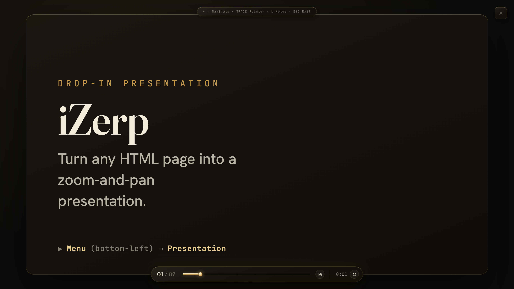
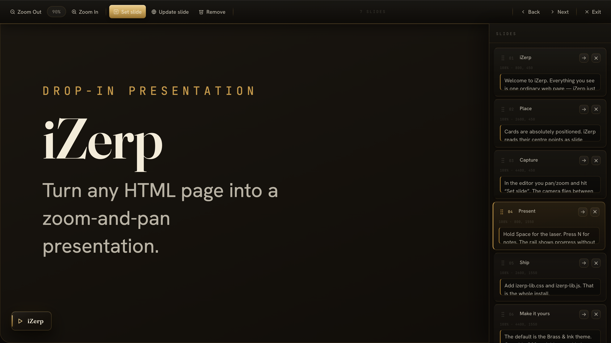
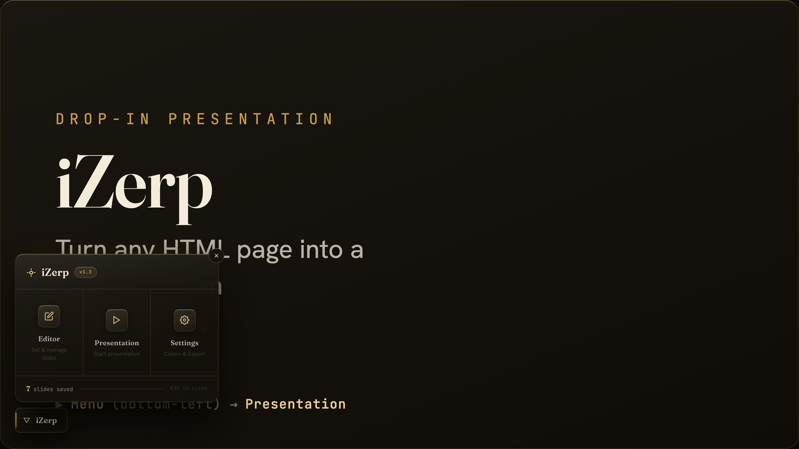
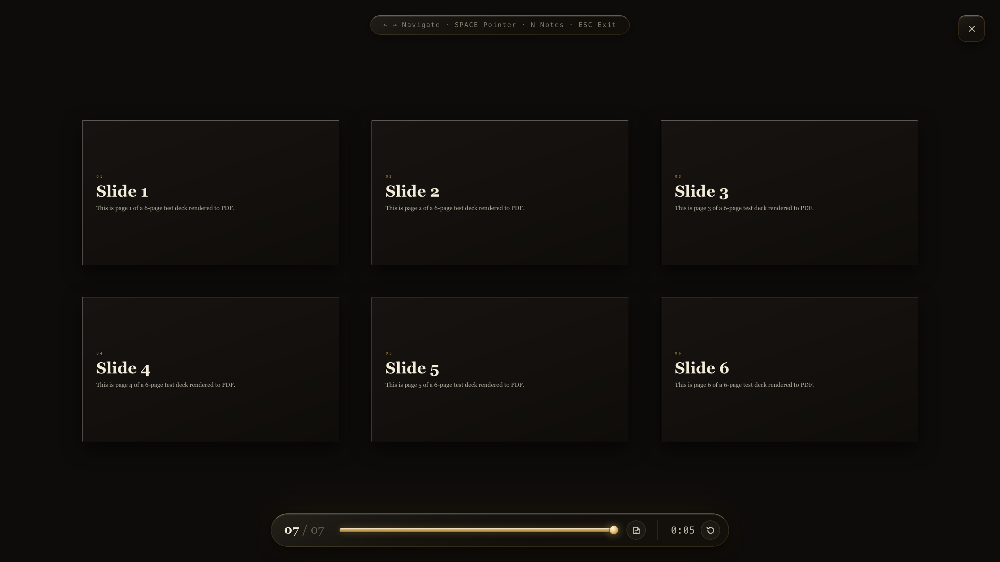

# iZerp — Anleitung & Dateiformat

<p align="center">
  <a href="LICENSE"></a>
  
  
  
  <a href="https://hub.docker.com/r/illustratus/izerp"></a>
</p>

> 🌐 **Sprache:** Deutsch (diese Datei) · [English](README.md)
> Beide Fassungen sind inhaltlich deckungsgleich — dieselben Abschnitte, dieselbe
> Tiefe, nur in verschiedenen Sprachen.

**iZerp** verwandelt eine beliebige HTML-Seite in eine zoom- und schwenkbare
Präsentation im Prezi-Stil. Inhalte werden frei auf einer großen Fläche
(„Canvas") platziert; einzelne Ausschnitte werden als **Folien** gespeichert und
nacheinander abgespielt. Die weiche Kamerafahrt zwischen den Folien erzeugt den
Prezi-Effekt.



<p align="center">
  
  &nbsp;
  
</p>

<p align="center"><strong>▶ <a href="https://illustratus.github.io/iZerp/">Live-Demo</a></strong> · zwei Dateien, kein Build, keine Dependencies, kein externer Request</p>

iZerp besteht im Kern aus **zwei Dateien** und kennt ein eigenes Dateiformat:

| Datei                     | Zweck                                                   |
| ------------------------- | ------------------------------------------------------- |
| `izerp-lib.css`           | Aussehen der Bedienoberfläche (Default-Theme „Brass & Ink") |
| `izerp-lib.js`            | Logik: Kamera, Folien, Speicherung, Im-/Export          |
| `*.izerp`                 | Austauschformat für Folien + Einstellungen (JSON)       |
| `izerp-fonts.css`         | **optional** — stellt die originalen Web-Schriften wieder her |
| `izerp-theme-neutral.css` | **optional** — neutrales Skin / Vorlage fürs Theming    |

Diese Anleitung beschreibt iZerp **allgemein**. Abschnitt 8 spezifiziert das
`.izerp`-Format vollständig; Abschnitt 9 zeigt, wie eine **KI** daraus eine
Präsentation **automatisch** erzeugt; Abschnitt 12 beschreibt das
**Docker-Image**, das aus einem PDF eine gehostete Präsentation macht — ganz
ohne eigenes HTML.

---

## 1. Einbinden

Zwei Zeilen genügen. Das Skript packt **automatisch** den gesamten Body-Inhalt in
eine zoombare Fläche.

```html
<!DOCTYPE html>
<html lang="de">            <!-- lang steuert die Oberflächensprache (de/en) -->
<head>
  <link rel="stylesheet" href="izerp-lib.css">
</head>
<body>

  <!-- Beliebiger Inhalt, frei positioniert (siehe Abschnitt 9) -->

  <script src="izerp-lib.js"></script>   <!-- als LETZTES vor </body> -->
</body>
</html>
```

> Das `<script>` muss **nach** dem Inhalt stehen, damit dieser beim Laden
> eingepackt werden kann.

Beim Start erscheint unten links ein **iZerp-Knopf** (FAB), der das Menü öffnet.

### Schriften — kein externer Request

`izerp-lib.css` lädt **keine** Web-Schriften und macht **keinen** Netzwerk-Request.
Standard ist ein System-Font-Stack. Der originale „Brass & Ink"-Look (Fraunces /
Hanken Grotesk / JetBrains Mono) ist **opt-in**: `izerp-fonts.css` **nach**
`izerp-lib.css` einbinden — oder die Variablen `--p-display` / `--p-body` /
`--p-mono` selbst überschreiben (siehe Abschnitt 5 → Theming).

### Konfiguration (`data-*`, `window.iZerpConfig`, `iZerp.init`)

iZerp startet ohne Konfiguration. Anpassen geht über drei gleichwertige Quellen
(Präzedenz, später gewinnt): `window.iZerpConfig` → `data-*` am Script-Tag →
`iZerp.init(options)`.

| Option       | `data-*`            | Bedeutung                                                        |
| ------------ | ------------------- | ---------------------------------------------------------------- |
| `slides`     | `data-slides`       | URL einer `.izerp`-Datei als Standard-Foliensatz (http[s]).      |
| `lang`       | `data-lang`         | `de` \| `en` \| `auto` (Standard `auto`).                        |
| `storageKey` | `data-storage-key`  | Fester Speicher-Schlüssel statt pro-URL (übersteht Umbenennen).  |
| `persist`    | `data-persist`      | `false` → nie in localStorage schreiben (nur im Speicher).       |
| `fab`        | `data-fab`          | `false` → FAB ausblenden, iZerp per API steuern.                 |
| `target`     | `data-target`       | CSS-Selektor des zu umwickelnden Elements (Standard `<body>`).   |
| `autoInit`   | `data-auto-init`    | `false` → nicht automatisch starten; `iZerp.init()` selbst rufen.|
| `languages`  | *(nur Objekt)*      | UI-Sprachen ergänzen/überschreiben: `{ code: { …strings } }`. Siehe Abschnitt 5.|

```html
<!-- Beispiel: englisch erzwingen, FAB verstecken, fester Schlüssel -->
<script src="izerp-lib.js"
        data-lang="en" data-fab="false" data-storage-key="my-deck"></script>
```

### Folien automatisch laden (`data-slides`)

Folien können in einer begleitenden `.izerp`-Datei liegen und **automatisch**
geladen werden — über ein Attribut am Script-Tag:

```html
<script src="izerp-lib.js" data-slides="folien.izerp"></script>
```

iZerp lädt die Datei beim Start und nutzt sie als **Standard-Foliensatz**.
Regeln:

- Geladen wird **nur, wenn diese Seite noch keine eigenen Folien** (im
  localStorage) hat. Sobald im Editor etwas geändert wird, gewinnen die
  gespeicherten Folien — die Datei wird dann ignoriert.
- Die Datei wird **nicht** in den localStorage kopiert. Aktualisierst du
  `folien.izerp`, erscheint die Änderung beim nächsten Neuladen (solange keine
  eigenen Edits existieren). Die `.izerp`-Datei bleibt damit die Quelle.
- Farben aus der Datei (`settings`) werden für den vorgesehenen Look angewandt,
  ohne die globalen Einstellungen zu überschreiben.

> ⚠️ **Server nötig:** `data-slides` nutzt `fetch` und funktioniert nur über
> **http(s)**. Beim direkten Öffnen per `file://` blockiert der Browser den
> Zugriff (eine Konsolenmeldung weist darauf hin). Dann entweder über einen
> lokalen Server öffnen (z. B. `python3 -m http.server` im Ordner) **oder** die
> Datei einmalig manuell über **Settings → „.izerp öffnen"** importieren.

---

## 2. Die drei Modi

| Modus            | Wofür                                          |
| ---------------- | ---------------------------------------------- |
| **Editor**       | Folien anlegen, anordnen, mit Notizen versehen |
| **Presentation** | Vortrag abspielen                              |
| **Settings**     | Farben, Sprache, Im-/Export, Zurücksetzen      |

`Esc` schließt jeden Modus.

---

## 3. Editor — Folien aufnehmen

**Bewegen:**

- **Schwenken:** linke Maustaste gedrückt halten und ziehen — oder mit einem
  Finger ziehen.
- **Zoomen:** Mausrad (zoomt auf den Mauszeiger), Zwei-Finger-**Pinch** oder die
  Knöpfe **+ / −**.
- **Zoom-Anzeige** anklicken → zurück auf 100 %.

**Folien:**

- **„Folie setzen"** speichert den aktuellen Ausschnitt als neue Folie.
- Steht man genau auf einer Folie, wird daraus **„Folie aktualisieren"**.
- **„Entfernen"** löscht die gewählte Folie.

**Folienliste (rechts):** Titel bearbeiten, Sprechernotizen eintragen, per
Drag-and-drop umsortieren, zur Folie fliegen oder löschen.

**Tastatur:** `←/↑` vorige · `→/↓` nächste · `Esc` beenden.

---

## 4. Presentation — abspielen

| Taste / Aktion               | Wirkung                                              |
| ---------------------------- | ---------------------------------------------------- |
| `→` `↓` `Bild ab` · Wisch ←  | nächste Folie                                        |
| `←` `↑` `Bild auf` · Wisch → | vorige Folie                                         |
| **`Leertaste` halten**       | Laserpointer (folgt der Maus); loslassen blendet aus |
| `N`                          | Sprechernotizen ein-/ausblenden                      |
| `Esc`                        | beenden                                              |

Auf Touch-Geräten blättert ein horizontaler **Wisch** durch den Foliensatz.

Eingeblendet ist eine kompakte **Schiene** am unteren Rand: Foliennummer,
ein graduierter **Fortschrittsbalken** und der Timer mit **RESET**. Sie hält
sich an die Unterkante und verdeckt den Inhalt nicht — der Vortragende liest
das Tempo ab, das Publikum den Fortschritt.

Die **Sprechernotizen** sind standardmäßig eingeklappt (Bühne bleibt frei) und
werden über die Schiene oder mit **`N`** aufgerufen. Das eingeblendete Panel
zeigt Titel, Notizen und die **nächste** Folie. Vollbild über die
Browser-Funktion (`F11`).

### Notizen in der Konsole — ein heimlicher Teleprompter

Bei jedem Folienwechsel schreibt iZerp Titel und Notizen der aktuellen Folie
zusätzlich **in die Browser-Konsole**. Da sich die DevTools in ein eigenes
Fenster abkoppeln lassen (DevTools → ⋮-Menü → *Dock side* → *Separates Fenster*),
ergibt das einen unsichtbaren Teleprompter:

1. Präsentation starten, DevTools öffnen und die Konsole in ein separates Fenster
   abkoppeln (auf einen zweiten Bildschirm schieben oder außerhalb des sichtbaren
   Bereichs halten).
2. Beim Screen-Sharing **nur das Präsentationsfenster** teilen — nicht den ganzen
   Bildschirm.
3. Die Notizen im Konsolenfenster mitlesen. Das Publikum sieht nur die Folie und
   merkt nicht, dass du unter Umständen abliest.

Die Konsolenzeile aktualisiert sich beim Navigieren automatisch und zeigt immer
die Notizen der Folie, die gerade auf der Bühne ist.

---

## 5. Settings

- **Farben:** Primär (Akzent/Fortschritt/Buttons), Sekundär (Panel-Hintergrund),
  Tertiär (Text auf Panels).
- **Sprache:** Deutsch / English (Standard: automatisch erkannt).
- **Datei:** **„Als .izerp speichern"** (Export) · **„.izerp öffnen"** (Import).
- **Gefahrenzone:** alle Folien löschen.
- Abschließend **„Einstellungen speichern"**.

### Theming (CSS-Variablen)

Der Default ist das **„Brass & Ink"**-Theme. Alle Farben und Schriften sind
CSS-Custom-Properties auf `#izerp-root` und lassen sich in einem eigenen
Stylesheet (**nach** `izerp-lib.css` geladen) überschreiben — ohne die Lib
anzufassen. Ein fertiges, zurückhaltendes Skin liegt als
`izerp-theme-neutral.css` bei (gute Vorlage zum Kopieren). Die wichtigsten
Variablen: `--brass*` (Metall), `--ink*` (Flächen), `--line*` (Haarlinien),
`--tx-*` (Text), `--p-display` / `--p-body` / `--p-mono` (Schriften).

### Eigene Sprachen (ohne Source-Edit)

iZerp bringt `de` und `en` mit. Jede Sprache lässt sich zur Laufzeit ergänzen
oder überschreiben — ohne Änderung am Quellcode. Teilweise Wörterbücher sind
erlaubt; fehlende Keys fallen auf Englisch zurück.

```js
// per Config…
window.iZerpConfig = {
  lang: 'fr',
  languages: { fr: { editorLabel: 'Éditeur', presentationLabel: 'Présentation' } },
};
// …oder per API vor init:
iZerp.registerLanguage('fr', { editorLabel: 'Éditeur' });
```

Die String-Keys sind in der `STRINGS`-Tabelle oben in `izerp-lib.js` definiert.

---

## 6. Speicherung

iZerp speichert **lokal im Browser** (localStorage) — ohne Server.

| Inhalt        | Schlüssel                             | Geltungsbereich              |
| ------------- | ------------------------------------- | ---------------------------- |
| Folien        | `izerp:slides:<pfad+query der Seite>` | **pro Seite (URL)** getrennt |
| Einstellungen | `izerp:settings`                      | global                       |

> ⚠️ Folien hängen am **URL-Pfad**. Wird die HTML-Datei verschoben/umbenannt,
> verweist der Browser auf eine andere Seite und die Folien „fehlen" (sie sind
> nicht gelöscht). Auch andere Browser / Inkognito haben eigenen Speicher.
> **Lösung:** Folien als `.izerp` exportieren und am neuen Ort importieren. (Oder
> mit `data-storage-key` einen festen Schlüssel setzen — siehe Abschnitt 1.)

---

## 7. Programmier-Schnittstelle

Nach dem Laden steht `window.iZerp` bereit:

```js
iZerp.version          // z. B. "1.3"
iZerp.init(options)    // manuell starten (bei data-auto-init="false"); gibt iZerp zurück
iZerp.destroy()        // vollständig abbauen: Listener/Knoten entfernen, Body entpacken
iZerp.getSlides()      // Array-Kopie aller Folien
iZerp.getCurrentIndex()// Index der aktiven Folie (0-basiert; -1 = keine)
iZerp.getCurrentSlide()// aktives Folien-Objekt oder null
iZerp.getConfig()      // Kopie der aufgelösten Konfiguration
iZerp.isReady()        // true, sobald initialisiert
iZerp.setMode('presentation' | 'editor' | 'settings' | 'idle')
iZerp.saveToFile()     // .izerp-Export auslösen
iZerp.loadFromFile()   // .izerp-Import-Dialog öffnen
iZerp.registerLanguage(code, dict) // UI-Sprache zur Laufzeit ergänzen/überschreiben
iZerp.on(type, handler)// Event abonnieren; gibt eine Abmelde-Funktion zurück
iZerp.off(type, handler)
```

> **`destroy()`** meldet alle Document-Listener ab, entfernt die iZerp-Knoten
> und macht das Body-Wrapping rückgängig — der Host bleibt sauber zurück.
> Danach ist ein erneutes `iZerp.init()` möglich (wichtig für SPAs / Reuse).
> `iZerp.on`-Abonnements überleben ein `destroy()`/`init()`.

### Event-API

Damit die Host-Seite (z. B. die Folien-HTML) deterministisch auf die
Navigation reagieren kann — statt jeden Frame die Geometrie zu messen — meldet
iZerp Ereignisse. Zwei gleichwertige Wege:

```js
// a) komfortabel über iZerp.on (gibt eine Abmelde-Funktion zurück)
const stop = iZerp.on('slidechange', ({ index, total, slide }) => { … });

// b) als bubbelndes DOM-Event auf document — unabhängig von der
//    Skript-Ladereihenfolge (funktioniert auch, bevor iZerp initialisiert ist)
document.addEventListener('izerp:slidechange', e => { e.detail.index; });
```

| Event               | `detail`                        | Wann                                                                                                                              |
| ------------------- | ------------------------------- | --------------------------------------------------------------------------------------------------------------------------------- |
| `ready`             | `{ version, total }`            | iZerp initialisiert **und** `data-slides` geladen — ab jetzt ist `getSlides()` sicher                                             |
| `slidechange`       | `{ index, total, slide, mode }` | Aktive Folie wechselt (Kamerafahrt **beginnt**)                                                                                   |
| `slidesettled`      | `{ index, total, slide, mode }` | Kamerafahrt zu dieser Folie **gelandet** (entfällt bei schneller Weiternavigation)                                                |
| `presentationstart` | `{ total }`                     | Präsentation startet (vor der ersten Folie)                                                                                       |
| `presentationend`   | `{ mode, total, elapsedMs }`    | Präsentation verlassen; `elapsedMs` = gelaufene Vortragszeit                                                                      |
| `modechange`        | `{ mode, total }`               | Jeder Moduswechsel                                                                                                                |
| `deckchange`        | `{ slides, total, reason }`     | **Foliensatz** ändert sich (nicht Navigation); `reason` ∈ `add`, `update`, `remove`, `reorder`, `clear`, `import`, `load`, `edit` |
| `laserchange`       | `{ active, x, y }`              | Laserpointer ein-/ausgeblendet                                                                                                    |
| `settingschange`    | `{ settings }`                  | Farben/Sprache gespeichert                                                                                                        |

`index` ist 0-basiert (`-1` = nichts aktiv), `slide` das Folien-Objekt oder
`null`. Die Folien-HTML im Beispiel nutzt `izerp:slidechange`, um die
Einblend-Choreografie pro Folie genau **einmal** auszulösen (kein Flackern).

---

## 8. Das `.izerp`-Dateiformat

Eine `.izerp`-Datei ist **JSON**. Beim Export schreibt iZerp:

```json
{
  "version": "1.3",
  "savedAt": "2026-06-27T08:12:31.689Z",
  "slides": [
    {
      "id": "s1",
      "title": "Titel der Folie",
      "cx": 1500,
      "cy": 900,
      "scale": 1.08,
      "vw": 1920,
      "vh": 1080,
      "notes": "Sprechernotizen für das Speaker-Panel."
    }
  ],
  "settings": {
    "colorPrimary": "#e4003a",
    "colorSecondary": "#0a0a0a",
    "colorTertiary": "#ffffff",
    "lang": "de"
  }
}
```

### Felder oberster Ebene

| Feld       | Pflicht beim Import? | Bedeutung                                              |
| ---------- | -------------------- | ------------------------------------------------------ |
| `slides`   | **ja**               | Array der Folien (Reihenfolge = Abspielreihenfolge)    |
| `settings` | optional             | Farben + Sprache; wird auf die Einstellungen angewandt |
| `version`  | wird ignoriert       | nur informativ (Export-Version)                        |
| `savedAt`  | wird ignoriert       | nur informativ (ISO-Zeitstempel)                       |

> **Minimal gültige Datei:** `{ "slides": [ … ] }`. `version`, `savedAt` und
> `settings` sind optional. Import wendet die Folien auf **die gerade geöffnete
> Seite** an (überschreibt deren bisherige Folien).

### Aufbau eines Folien-Objekts

| Feld    | Typ    | Bedeutung                                                          |
| ------- | ------ | ------------------------------------------------------------------ |
| `id`    | string | eindeutige Kennung (beliebig, z. B. `"s1"`)                        |
| `title` | string | Titel in Folienliste & Speaker-Panel                               |
| `cx`    | number | **x-Mittelpunkt** des Ausschnitts in **Canvas-Pixeln**             |
| `cy`    | number | **y-Mittelpunkt** des Ausschnitts in **Canvas-Pixeln**             |
| `scale` | number | Zoomfaktor (1 = 100 %; >1 näher heran, <1 weiter weg)              |
| `vw`    | number | Viewport-**Breite** bei der Aufnahme (Referenz für die Einpassung) |
| `vh`    | number | Viewport-**Höhe** bei der Aufnahme                                 |
| `notes` | string | Sprechernotizen (darf leer sein)                                   |

### Settings-Objekt

| Feld             | Bedeutung                                 |
| ---------------- | ----------------------------------------- |
| `colorPrimary`   | Akzent, Fortschrittsbalken, Buttons (Hex) |
| `colorSecondary` | Panel-Hintergrund (Hex)                   |
| `colorTertiary`  | Textfarbe auf Panels (Hex)                |
| `lang`           | `"de"`, `"en"` oder `"auto"`              |

---

## 9. Automatische Erstellung durch eine KI

Eine KI kann eine vollständige iZerp-Präsentation erzeugen, indem sie **zwei
Artefakte** produziert:

1. eine **HTML-Seite**, die `izerp-lib.css` + `izerp-lib.js` einbindet und die
   Inhalte als frei positionierte Elemente auf der Canvas anordnet;
2. eine Liste von **Folien** (Kamerafahrten), entweder als `.izerp`-Datei zum
   Importieren oder direkt in den localStorage geschrieben.

Damit Schritt 2 funktioniert, muss die KI das **Koordinatensystem** verstehen.

### Das Koordinatensystem

- Der Body wird in `#izerp-canvas-wrap` eingepackt; dessen `transform-origin` ist
  `0 0` (oben links). Ein Element, das per CSS auf `left:X; top:Y; width:W;
  height:H` gesetzt ist, belegt damit **Canvas-Koordinaten** `X … X+W` /
  `Y … Y+H`. Sein Mittelpunkt liegt bei `(X + W/2, Y + H/2)`.
- Eine Folie zielt mit `cx`/`cy` auf einen Punkt in **genau diesem**
  Koordinatensystem und zoomt mit `scale` darauf.
- Beim Abspielen passt iZerp jede Folie ein („contain-fit"): der bei der Aufnahme
  festgehaltene Bereich bleibt **immer vollständig sichtbar**. Effektiver Zoom =
  `scale × min(Fenster_w / vw, Fenster_h / vh)`. **Auf der Referenzauflösung
  (`vw`×`vh`) ist der effektive Zoom genau `scale`.**

### Rezept: ein Element formatfüllend rahmen

Gegeben ein Inhaltselement mit Mittelpunkt `(cx, cy)` und Breite `W` (Canvas-Px).
Es soll den Anteil `F` der Breite einer Referenz-Ansicht `REF_VW × REF_VH`
ausfüllen (z. B. 16:9 = 1920×1080, `F ≈ 0.9` für etwas Rand):

```text
scale = F × REF_VW / W
vw    = REF_VW
vh    = REF_VH
```

Beispiel: Karte 1600 px breit, `REF_VW = 1920`, `F = 0.9` →
`scale = 0.9 × 1920 / 1600 = 1.08`.

> **Empfehlung:** Alle Inhaltskarten im selben Seitenverhältnis wie die
> Präsentation (meist 16:9) und in einheitlicher Größe anlegen, dann ist `scale`
> für alle Folien identisch und das Layout wirkt ruhig.

### Rezept: Übersichts-/Schlussfolie (ganze Fläche)

Um die **komplette** Canvas (`CANVAS_W × CANVAS_H`) einzupassen:

```text
cx    = CANVAS_W / 2
cy    = CANVAS_H / 2
scale = min(REF_VW / CANVAS_W, REF_VH / CANVAS_H) × F
```

### Empfohlener Arbeitsablauf der KI

1. **Inhalt entwerfen** → Liste von Stationen (Titel, Inhalt, Sprechernotizen).
2. **Layout festlegen** → jeder Station feste Canvas-Koordinaten geben (z. B.
   Raster oder Schlangenpfad), Karten gleich groß.
3. **HTML rendern** → Karten als `position:absolute` mit `left/top/width/height`
   im eingebundenen Inhaltsbereich.
4. **Folien berechnen** → pro Station mit dem Rezept oben `cx/cy/scale/vw/vh`
   bestimmen; `notes` setzen.
5. **Folien als `.izerp`-Datei schreiben** → Objekt `{ "slides": [...],
   "settings": {...} }` neben die HTML-Datei legen (z. B. `folien.izerp`).
6. **Auto-Laden verdrahten** → am Script-Tag `data-slides` setzen:
   `<script src="izerp-lib.js" data-slides="folien.izerp"></script>` (siehe
   Abschnitt 1). Die Seite über http(s) ausliefern. Damit ist die Präsentation
   **schlüsselfertig**: HTML + `.izerp` + die zwei Lib-Dateien öffnen, fertig.

> Eine einzige Datenquelle (z. B. ein `STATIONS`-Array) sollte **sowohl** das
> HTML **als auch** die `.izerp`-Folien speisen — so können Karten und
> Kamerafahrten nicht auseinanderlaufen. Genau das zeigt
> [`examples/basic.html`](examples/basic.html).
>
> **Reine `file://`-Auslieferung?** Dann ist `fetch` blockiert; nutze stattdessen
> die localStorage-Seed-Variante unten oder lass den Nutzer einmalig manuell
> importieren.

### Variante: Folien per localStorage seeden

Statt einer `.izerp`-Datei kann die KI die Folien direkt in den localStorage
schreiben — **vor** dem `izerp-lib.js`-Tag, unter dem Seiten-Schlüssel. izerp
liest sie dann beim Laden:

```js
const key = 'izerp:slides:' + location.pathname + location.search;
if (!localStorage.getItem(key)) {          // vorhandene Folien nicht überschreiben
  localStorage.setItem(key, JSON.stringify([
    { id:'s1', title:'Titel', cx:800, cy:450, scale:1, vw:1920, vh:1080, notes:'…' }
    // … weitere Folien
  ]));
}
```

Der Wert ist **dasselbe Folien-Array** wie im `slides`-Feld der `.izerp`-Datei.

### Zu beachten

- Alle Folien — auch die **erste** beim Start angefahrene — nutzen die
  contain-fit-Einpassung. Trotzdem für die **Zielauflösung** entwerfen und
  `F ≲ 0.9` wählen, damit auf abweichenden Fenstergrößen genug Rand bleibt.
- `id` muss eindeutig sein; `notes` darf leer (`""`) sein, aber sollte vorhanden
  sein.
- Import/Seed gelten **pro Seite** (URL).

---

## 10. Kurz-FAQ

**Folien sind „weg".** HTML-Datei verschoben/umbenannt oder anderer Browser
(Abschnitt 6) — per `.izerp` übertragen (oder festen `data-storage-key` setzen).

**Folien zwischen Geräten teilen.** `.izerp` exportieren, kopieren, auf der
Zielseite importieren.

**Inhalt wird beim Abspielen abgeschnitten.** In anderem Seitenverhältnis
aufgenommen als präsentiert — im Ziel-Seitenverhältnis (16:9) neu setzen oder
etwas weiter herauszoomen.

**Internet nötig?** Nein. iZerp läuft vollständig lokal und macht in der
Standardkonfiguration **keinen** Netzwerk-Request (System-Schriften). Nur das
optionale `izerp-fonts.css` lädt Web-Schriften nach — bei Bedarf lokal hinterlegen.

---

## 11. Browser-Support & Grenzen

**Eingabe:** Maus, Touch und Stift laufen über **einen** Code-Pfad — Ziehen zum
Schwenken, Zwei-Finger-Pinch zum Zoomen, horizontaler Wisch zum Blättern.

**Browser:** moderne Evergreen-Browser — Chrome/Edge, Firefox und Safari
(Desktop + Mobil), etwa die letzten zwei Jahre. Nutzt CSS-Custom-Properties,
Pointer Events und `backdrop-filter`. Die File System Access API für Im-/Export
hat einen **automatischen Download-/`<input type=file>`-Fallback**, damit ältere
Browser weiter funktionieren. Kein Internet Explorer.

**Barrierefreiheit:** durchgehend per Tastatur bedienbar; Menü- und
Settings-Dialog fangen den Fokus und geben ihn beim Schließen zurück;
Folienwechsel werden über eine `aria-live`-Region angesagt;
`prefers-reduced-motion` wird respektiert.

**Bekannte Grenzen:**

- **Eine Instanz.** iZerp ist global (`window.iZerp`); eine Instanz pro Seite.
- **Body-Wrapping.** Standardmäßig verschiebt iZerp alle `<body>`-Kinder in eine
  Canvas-Hülle. Hängt Host-CSS/-JS an direkten Body-Kindern, iZerp per
  `data-target` auf einen Container beschränken (Pan/Zoom laufen dann
  container-relativ).
- **Theming-Reichweite.** Farben und Schriften sind CSS-Variablen
  (`izerp-theme-neutral.css` ist ein vollständiges Beispiel); einige semantische
  Akzente (Gefahr-Rot, Warn-Orange, der weiße Laser-Kern) sind bewusst fix und
  folgen dem Brand-Theme nicht.
- **Speicher ist pro-URL**, außer man setzt `data-storage-key` (siehe Abschnitt 6).

---

## 12. Docker — eine Präsentation aus einem PDF, gehostet

Alles bisher setzt voraus, dass du das HTML schreibst. Wenn du stattdessen ein
**PDF** hast, übernimmt das offizielle Image diesen Teil: Es hostet eine Seite,
auf der du ein PDF hochlädst (und, falls vorhanden, eine `.izerp`-Datei),
rendert die Seiten auf eine Fläche und liefert das Ergebnis als ganz normale
iZerp-Präsentation aus.

```bash
docker run -p 8080:8080 -v "$PWD/decks:/data" illustratus/izerp
```

<http://localhost:8080> öffnen, PDF hochladen, **Present** drücken.



- **Ein Volume, einfache Dateien.** Alles landet in `/data` — einhängen, wohin
  du willst. Ein Ordner pro Präsentation, darin das Original-PDF, die
  Seitenbilder und die `deck.izerp`. Sichern heißt: Ordner kopieren.
- **Mehrere Präsentationen, umschaltbar.** Die Startseite listet jede
  Präsentation auf dem Volume; in einer laufenden Präsentation wechselt eine
  kleine Leiste oben links zwischen ihnen und tritt beim Vortrag zur Seite.
- **Folien, die du bestimmst.** Ohne `.izerp`-Datei erzeugt der Container eine
  Folie pro Seite plus eine Übersichtsfolie. Du kannst eine eigene hochladen, im
  iZerp-Editor bearbeiten und exportieren, oder per *Regenerate* den
  Ausgangszustand zurückholen. Das Canvas-Layout ist deterministisch und
  dokumentiert — eine KI kann also genau wie in Abschnitt 9 eine `.izerp` dafür
  schreiben.
- **Weiterhin kein externer Request, weiterhin keine Dependencies.** Der Server
  ist die Python-Standardbibliothek plus `pdftoppm`; die Seite lädt nichts außer
  `izerp-lib.js` und `izerp-lib.css`.
- **Keine Authentifizierung.** Wer den Port erreicht, kann hochladen und
  löschen. Also hinter einen Reverse Proxy stellen — oder nur lesend betreiben
  (`IZERP_READ_ONLY=1`).

Vollständige Dokumentation — Konfiguration, exaktes Canvas-Layout, Sicherheit,
Tags: **[docker/README.md](docker/README.md)**.

---

## Lizenz

[MIT](LICENSE) © Illustratus. Beiträge willkommen — siehe
[CONTRIBUTING.md](CONTRIBUTING.md) und den [CHANGELOG](CHANGELOG.md).
